# Multi-Level Richardson Extrapolation for Diffusion ODE Sampling

Reproduction and extension of **RX-DPM** — Choi, Kang & Han, *Enhanced Diffusion
Sampling via Extrapolation with Multiple ODE Solutions*, ICLR 2025
([arXiv:2504.01855](https://arxiv.org/abs/2504.01855)).

CSE 402 — Numerical Analysis, Simulation and Modeling Sessional, BUET.

**Team:** Abrar Zahin Raihan (2105009) · Sk. Ashrafuzzaman Nafees (2105008) ·
Mahmud Hasan (2105027) · Mirza Tawhid Umar (2105028) · Fatin Sadab (2105029)

---

## What this is

Diffusion models make images by solving an ODE step by step. Each step costs one
neural network call. So getting good images cheaply is a numerical methods
problem: cut the truncation error without taking more steps.

RX-DPM does this with **Richardson extrapolation**. It combines a coarse
one-step estimate and a fine multi-step estimate of the same interval to cancel
the leading error term. It is free, because the coarse estimate reuses a network
call the fine solver already made.

We reproduce that, then ask the obvious question: **why stop at two levels?**
Romberg integration stacks extrapolations into a tableau, each column killing
one more error term. We build the same tableau on non-uniform grids and measure
what happens.

## Results

Reproduction of **RX-DPM** (ICLR 2025) and our multi-level extension.

**Setup.** CIFAR-10 conditional 32×32, EDM backbone, RTX PRO 6000.
10,000 images per FID. Same seeds for every method. 80 configurations, 2h20m.
Analytic studies use a Gaussian-mixture ODE with a known exact solution, so
error there is measured, not estimated.

Figures are in [`outputs/figures/`](results/outputs/figures) as PDF. Every figure has
its data in [`outputs/figures/data/`](results/outputs/figures/data). Tables are in
[`outputs/results/`](results/outputs/results).

The full run is public on Kaggle:
**[02-run-pipeline-offline](https://www.kaggle.com/code/raihanzahin/02-run-pipeline-offline)**.

---

## 1. The reproduction works

FID at the validation gate. Mean ± std over 3 seed blocks. Lower is better.

| Method | NFE | Ours (10k) | Paper (50k) |
|---|---:|---:|---:|
| Euler | 10 | 17.48 ± 0.30 | 15.88 |
| Heun (EDM) | 11 | 16.45 ± 0.15 | 14.46 |
| **RX-Euler (k=2)** | 10 | **6.15 ± 0.04** | 4.35 |
| RX+EDM | 10 | 10.72 ± 0.07 | 4.26 |

RX-Euler is **2.8× better than Euler** at the same cost. It also beats Heun,
even though Heun gets an extra evaluation.

Our numbers are higher than the paper's because we use 10k images instead of
50k. FID reads high on smaller samples. The ranking is what matters.

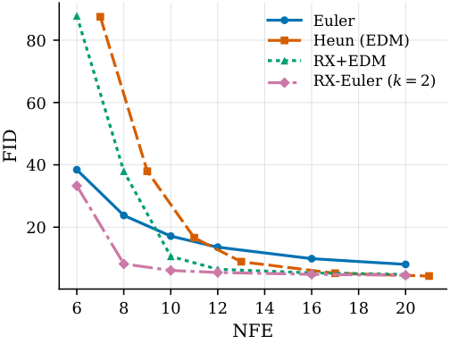
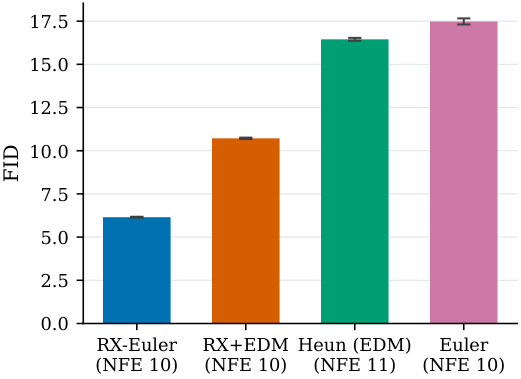

FID across the whole budget range:

| NFE | 6 | 8 | 10 | 12 | 16 | 20 |
|---|---:|---:|---:|---:|---:|---:|
| Euler | 38.43 | 23.78 | 17.14 | 13.58 | 9.89 | 8.06 |
| RX-Euler | **33.27** | **8.21** | **6.12** | **5.47** | **4.86** | **4.57** |

---

## 2. Grid-aware coefficients beat the classical ones

This is the paper's main claim. It holds at every budget.

| NFE | 6 | 8 | 10 | 12 | 16 | 20 |
|---|---:|---:|---:|---:|---:|---:|
| Naïve Richardson | 30.21 | 18.30 | 13.41 | 10.65 | 7.91 | 6.60 |
| Grid-aware (RX) | 33.27 | **8.21** | **6.12** | **5.47** | **4.86** | **4.57** |

At NFE 10 the grid-aware version is **2.2× better**.

We also confirm k=2 is the best block size, which is what the paper uses.

| NFE | k=2 | k=3 | k=4 |
|---|---:|---:|---:|
| 10 | **6.12** | 9.04 | 10.29 |
| 16 | **4.86** | 5.21 | 5.43 |
| 20 | **4.57** | 4.94 | 4.96 |

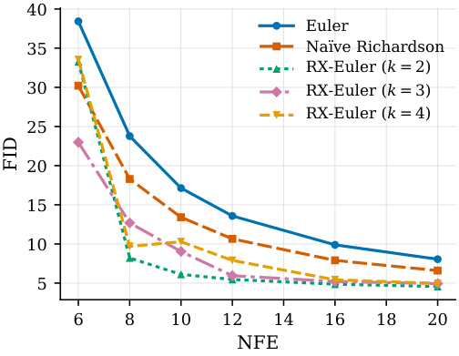

---

## 3. Our extension: more levels does not work

We stacked extrapolations into a Romberg-style tableau. More levels should
cancel more error terms. It does not.

FID on CIFAR-10:

| NFE | L=2 | L=3 | L=4 |
|---|---:|---:|---:|
| 8 | **8.21** | 242.8 | 153.5 |
| 10 | **6.12** | 66.3 | 113.2 |
| 16 | **4.86** | 65.2 | 80.6 |

Going from 2 levels to 3 makes FID **11× worse**.

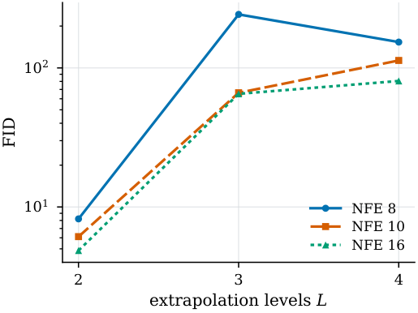

---

## 4. Why it fails: the reuse trick only works at 2 levels

RX-DPM is free because the coarse estimate reuses a network call the fine
solver already made. At 2 levels this is exact. At 3+ levels it is an
approximation, and that approximation caps the accuracy.

Fitted local order on the analytic problem (r² ≈ 0.999):

| L | Reuse (0 extra NFE) | Exact (extra NFE) | Predicted | Extra NFE |
|---:|---:|---:|---:|---:|
| 2 | 3.22 | 3.22 | 3 | 0 |
| 3 | 3.21 | 4.28 | 4 | 1 |
| 4 | 3.22 | 5.36 | 5 | 4 |
| 5 | 3.22 | 5.90 | 6 | 11 |

Read the rows: at L=2 both columns are **identical**, because nothing is
approximated. From L=3 on, reuse is **stuck at 3.2** while exact keeps
improving.

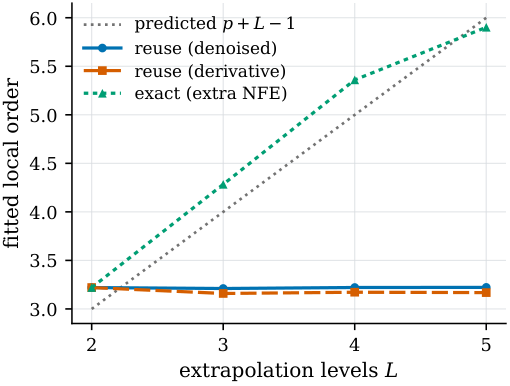

The same thing shows up on CIFAR-10. At L=2 reuse and exact give the same FID
to the last digit. At L=3+ they differ, and neither is good.

| L | Mode | FID @ NFE 10 | FID @ NFE 16 |
|---:|---|---:|---:|
| 2 | reuse | 6.12 | 4.86 |
| 2 | exact | 6.12 | 4.86 |
| 3 | reuse | 66.3 | 65.2 |
| 3 | exact | 45.5 (NFE 12) | 6.35 (NFE 20) |

Even paying the extra evaluations does not pay off. L=3 exact reaches 6.35 at
NFE 20. Plain L=2 reaches 4.57 at the same NFE.

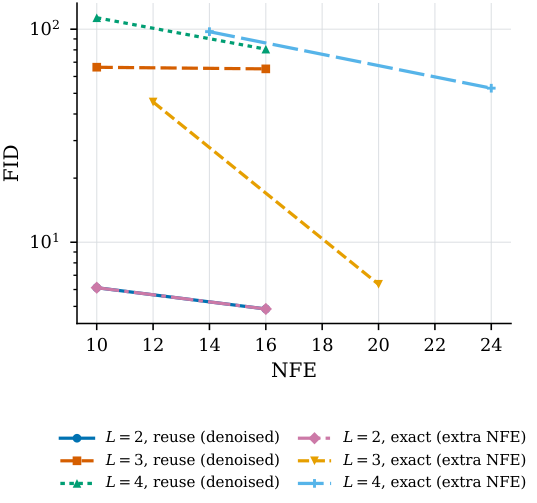

---

## 5. The weight system gets badly conditioned

Each extra level makes the linear system about 10× worse conditioned.

| L | κ∞ | Σ\|w\| | Growth factor |
|---:|---:|---:|---:|
| 2 | 8.0 | 3.00 | 1.0 |
| 3 | 60.2 | 5.01 | 1.0 |
| 4 | 578.8 | 6.50 | 1.0 |
| 5 | 7 378 | 7.51 | 1.0 |
| 6 | 98 086 | 8.28 | 1.0 |
| 7 | 613 954 | 8.99 | 1.0 |

The growth factor stays at 1.0. That means our LU with partial pivoting is
fine. The bad conditioning is in the problem itself, not in our solver.

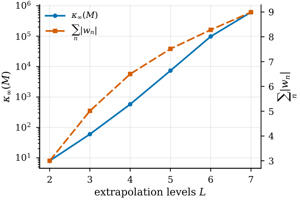
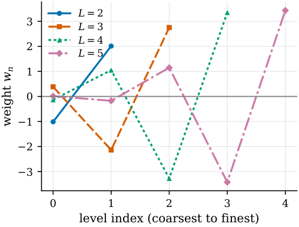

Relative error in the computed weights:

| L | float32 | float16 |
|---:|---:|---:|
| 2 | 1.6e-08 | 3.4e-04 |
| 4 | 4.4e-06 | 1.8e-03 |
| 5 | 2.4e-05 | 0.23 |
| 7 | 6.7e-04 | 0.92 |

In float16 the weights are essentially wrong by L=5.

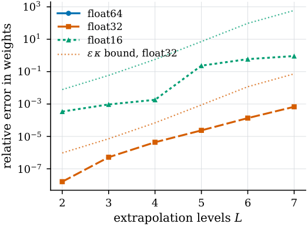

---

## 6. Round-off does not matter in practice

This surprised us. Changing the extrapolation arithmetic to float32 or float16
barely changes FID:

| NFE / L | float32 vs float64 | float16 vs float64 |
|---|---:|---:|
| 10 / L=2 | +0.0% | −0.1% |
| 16 / L=2 | 0.0% | 0.0% |

The reason is visible in the analytic study. RMS error vs number of steps:

| N | float64 | float32 | float16 |
|---:|---:|---:|---:|
| 64 | 1.47e-04 | 1.47e-04 | 1.36e-03 |
| 256 | **1.53e-06** | 1.61e-06 | 3.97e-03 |
| 1024 | 3.78e-06 | 3.90e-06 | 3.37e-03 |
| 2048 | 3.81e-06 | 4.36e-06 | 8.81e-03 |

float64 bottoms out at N=256 then gets worse. That is the classic
truncation-vs-round-off V-curve. But it happens at N=256, and real samplers use
N=10 to 20. So round-off never becomes the limit.

float16 hits a floor near 1e-3 and never improves.

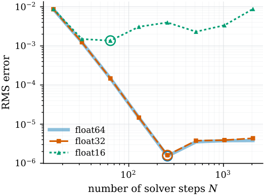
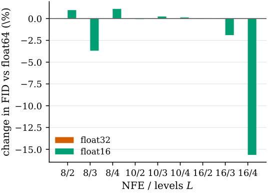

---

## 7. ρ = 7 is not optimal for RX

EDM picks ρ=7 by hand. We searched with golden-section search.

| Method | Best ρ | Error at best ρ | Error at ρ=7 |
|---|---:|---:|---:|
| Euler | 6.25 | 0.0840 | 0.0841 |
| Heun | 6.00 | 0.0112 | 0.0113 |
| RX | 8.00 | 0.0167 | 0.0200 |

On CIFAR-10 with FID, the best ρ is **6.16 (FID 5.95)** against 6.12 at ρ=7.
That is a 2.7% gain. Small but real.

The curve is not cleanly unimodal, so the honest claim is "the good region is
near 6", not "the optimum is 6.16".

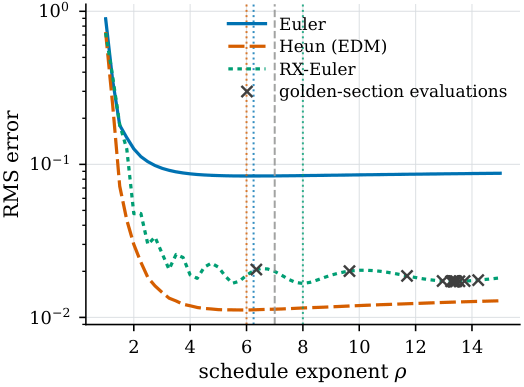
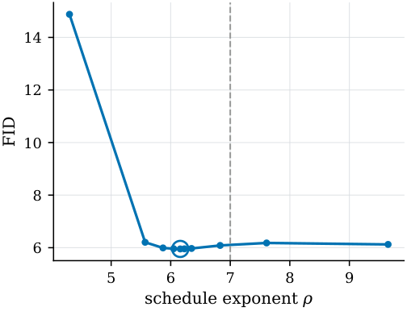

---

## 8. Convergence orders are correct

Sanity check that the harness is right. Fitted global order:

| Method | Fitted | Predicted |
|---|---:|---:|
| Euler | 1.02 | 1 |
| Heun | 2.05 | 2 |
| RX-Euler (L=2) | 1.94 | 2 |
| Naïve Richardson | 1.04 | 2 |

Euler and Heun hit their textbook orders exactly. RX-Euler reaches order 2 as
claimed. Naïve Richardson does not — it stays at order 1, which is why it
performs so much worse on CIFAR-10.

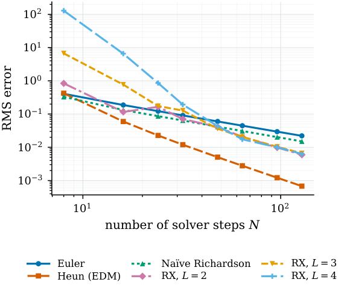

---

## Takeaways

1. **RX-DPM reproduces.** 2.8× better FID than Euler at the same cost. The
   grid-aware coefficients are what make it work.

2. **The extension fails, and we know exactly why.** More levels should give
   more accuracy. It does not, because the reuse trick that makes RX-DPM free
   is only exact at 2 levels. From 3 levels up, reuse caps the order at 3.2.

3. **The free lunch does not scale.** Paying the extra evaluations restores the
   accuracy but costs more than it gains. At NFE 20, L=3 exact gives 6.35 and
   plain L=2 gives 4.57.

4. **Round-off is not the bottleneck.** We expected precision to set the limit.
   It does not, because real samplers use 10–20 steps and the round-off wall is
   at 256+ steps. float16 extrapolation is safe in practice.

5. **ρ=7 is close but not optimal.** ρ≈6 is slightly better for RX. Worth 2.7%.

**One disagreement with the paper.** We find RX+EDM worse than plain RX-Euler
(10.72 vs 6.15). The paper finds it slightly better. The paper does not fully
specify where to split between Heun and RX steps, so this is likely a
difference in our reimplementation, not a refutation.

---

## Running it

Two Kaggle notebooks. The first needs internet, the second does not.

1. **`notebooks/01_prefetch_online.ipynb`** — Internet **ON**, Accelerator
   **None**. Clones this repo and NVlabs/edm, downloads the EDM CIFAR-10
   checkpoint, the Inception-v3 pickle and the FID reference stats (~340 MB),
   and writes `manifest.json`. Save & Run All.
2. **`notebooks/02_run_pipeline_offline.ipynb`** — Internet **OFF**, GPU on.
   Add notebook 01's output via **+ Add Input → Your Work → Notebooks**, set
   `PREFETCH_NAME` to its slug (or leave `None` to auto-discover), Run All.

The run that produced every number below is public on Kaggle:
**[02-run-pipeline-offline](https://www.kaggle.com/code/raihanzahin/02-run-pipeline-offline)**.

The GPU sweep is **resumable**. Finished runs are appended to
`results/fid_results.csv` and skipped next time, so a session that times out
just needs running again. A throughput probe measures your GPU's real speed and
projects the total before the sweep starts.

Tests, including a bit-exact check against the authors' published sampler:

```bash
PYTHONPATH=src python -m pytest tests -q     # 34 passed
```

## Layout

```
src/mlrx/
  linalg.py         LU with partial pivoting, condition number, growth factor
  regression.py     least squares via normal equations, for order fitting
  optimize.py       golden-section search
  extrapolation.py  the weight system — the numerical core
  schedules.py      EDM schedules, block partitioning, nested levels
  samplers.py       Euler, Heun, RX-DPM, multi-level RX
  toy.py            analytic Gaussian-mixture diffusion ODE with exact solution
  edm_model.py      pretrained EDM network loading
  fid.py            offline, single-process FID
  runner.py         resumable sweep execution
  experiments/      the studies
  plotting/         house style and figure builders
  pipeline.py       CPU and GPU stage drivers
notebooks/          the two Kaggle notebooks
results/outputs/    all tables, figures and figure data
tests/              including bit-exact equivalence with the reference code
```

## Correctness

`tests/test_reference_equivalence.py` copies the authors' sampler and
`get_coeff` verbatim and checks our rewrite matches it **to < 1e-12 across eight
step/frequency combinations**, with identical NFE. Our general L-level solver
reduces to their closed form exactly at L=2.

## Note on FID numbers

We use 10,000 images per FID, not the paper's 50,000. FID reads high on smaller
samples, so our absolute values sit above the published ones. Every method here
uses the same count and the same seeds, so they are comparable to each other.

## Attribution

`refcode/` and `tests/test_reference_equivalence.py` contain code from the
official RX-DPM release (`github.com/jin01020/rx-dpm`) and from
[NVlabs/edm](https://github.com/NVlabs/edm), licensed CC BY-NC-SA 4.0.
Checkpoints and FID statistics are NVIDIA's, under the same licence.
